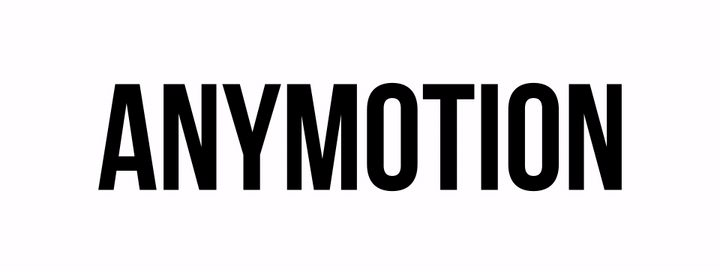

Anymotion provides one unified API for animating UIKit, CoreAnimation, POP and your library of choice

- **powerful oneliners**
- **grouping and chaining animations**
- **cancellable animations with callbacks for clean up**

### Installation

##### Pods
```
pod 'Anymotion'
```

##### Carthage
```
github "agensdev/anymotion"
```

##### Import in swift
```
import Anymotion
```

##### Import in Objective-C
```
#import <Anymotion/Anymotion.h>
```

### Basics

#### Powerful oneliners

Using a chainable builder pattern we can pack a good deal of configuration in one line
```objc
ANYAnimation *goRight = [[[ANYPOPSpring propertyNamed:kPOPViewCenter] toValueWithPoint:right] animationFor:view];
ANYAnimation *fadeOut = [[[[ANYCABasic new] toValue:@0] duration:1] animationFor:view.layer keyPath:@"opacity"];
```
Note: These animations won't start unless you say `start` like this
```objc
[goRight start];
[fadeOut start];
```
Thus making you able to define your animations once and then start and cancel them at your leisure.

#### POP, UIKit, CoreAnimation

##### POP spring
```objc
ANYAnimation *anim = [[[ANYPOPSpring propertyNamed:kPOPViewAlpha] toValue:@0] animationFor:view];
```

##### POP basic
```objc
ANYAnimation *anim = [[[[ANYPOPBasic propertyNamed:kPOPViewAlpha] toValue:@0] duration:0.5] animationFor:view];
```

##### POP decay
```objc
ANYAnimation *anim = [[[ANYPOPDecay propertyNamed:kPOPViewAlpha] velocity:@(-10)] animationFor:view];
```

##### CABasicAnimation
```objc
ANYAnimation *anim = [[[[ANYCABasic new] toValue:@0] duration:0.5] animationFor:view.layer keyPath:@"opacity"];
```

##### UIKit
```objc
ANYAnimation *anim = [ANYUIView animationWithDuration:0.5 block:^{
    view.alpha = 0.0;
}];
```

Ande more integrations to come...

#### Grouping

Start animations simultaneously

```objc
ANYAnimation *goRight = ...;
ANYAnimation *fadeOut = ...;
ANYAnimation *group = [ANYAnimation group:@[goRight, fadeOut]];
[group start];
```

#### Chaining

When one animation completes then start another
```objc
ANYAnimation *goRight = ...;
ANYAnimation *goLeft = ...;
ANYAnimation *group = [goRight then:goLeft];
[group start];
```

Chain and repeat indefinitely
```objc
ANYAnimation *goRight = ...;
ANYAnimation *goLeft = ...;
ANYAnimation *group = [[goRight then:goLeft] repeat];
[group start];
```

#### Start... and cancel

```objc
ANYAnimation *anim = ...;
ANYActivity *runningAnimation = [anim start];
...
[runningAnimation cancel];
```

#### Set up and clean up

```objc
ANYAnimation *pulsatingDot = ...;
[[pulsatingDot before:^{
  view.hidden = NO;
}] after:^{
  view.hidden = YES;
}];
[pulsatingDot start];
```

#### Callbacks

```objc
ANYAnimation *anim = ...;
[[anim onCompletion:^{
  NSLog(@"Animation completed");
} onError:^{
  NSLog(@"Animation was cancelled");
}] start];
```


## Who's behind this?

Made with love by [Agens.no](http://agens.no/), a company situated in Oslo, Norway.

[](http://agens.no/)
